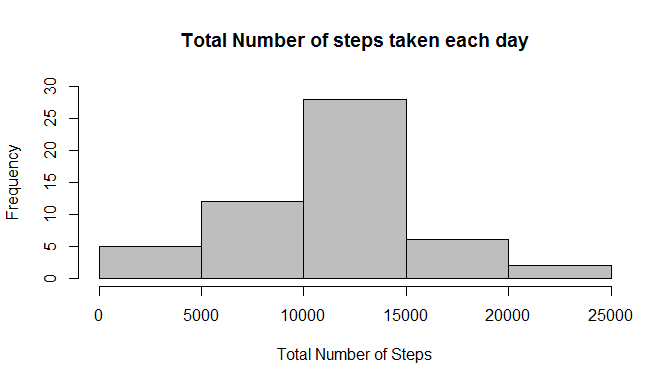
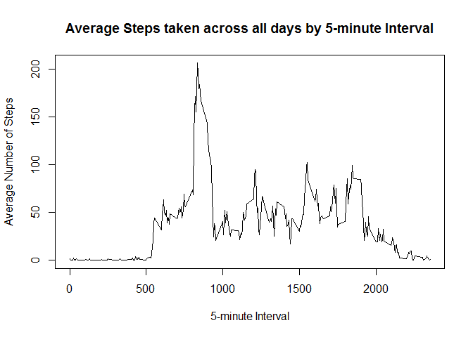
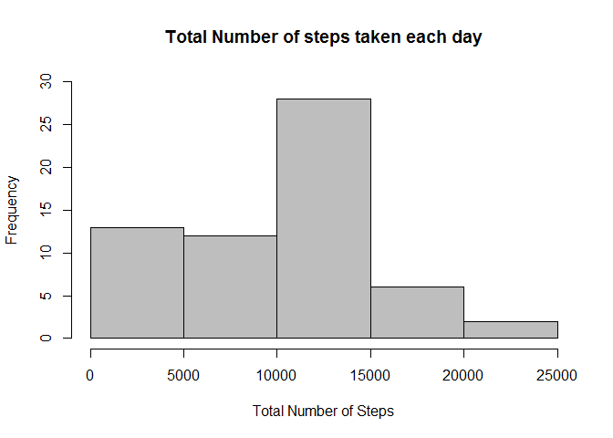
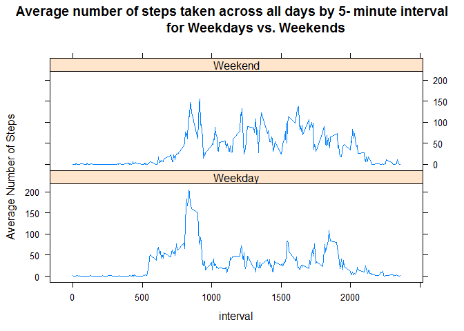

# Reproducible Research: Peer Assessment 1

## Loading and preprocessing the data

```r
setwd("C:/Users/xuspbern/RepData_PeerAssessment1")

library(dplyr)
```

```
## Warning: package 'dplyr' was built under R version 3.1.2
```

```r
library(lattice)
```


```r
unzip("activity.zip")
activity <- read.csv("activity.csv", header = TRUE, nrows =  17568, 
                     colClasses = c("integer", "POSIXct", "integer"))

summary(activity)
```

```
##      steps             date               interval     
##  Min.   :  0.00   Min.   :2012-10-01   Min.   :   0.0  
##  1st Qu.:  0.00   1st Qu.:2012-10-16   1st Qu.: 588.8  
##  Median :  0.00   Median :2012-10-31   Median :1177.5  
##  Mean   : 37.38   Mean   :2012-10-31   Mean   :1177.5  
##  3rd Qu.: 12.00   3rd Qu.:2012-11-15   3rd Qu.:1766.2  
##  Max.   :806.00   Max.   :2012-11-30   Max.   :2355.0  
##  NA's   :2304
```

## What is mean total number of steps taken per day?


```r
good <- complete.cases(activity)
complete <- activity[good, ]
complete <- data.frame(complete, row.names = NULL)

plot1 <- group_by(complete, date) %>% summarise(Total_Steps = sum(steps))

summary(plot1)
```

```
##       date                      Total_Steps   
##  Min.   :2012-10-02 00:00:00   Min.   :   41  
##  1st Qu.:2012-10-16 00:00:00   1st Qu.: 8841  
##  Median :2012-10-29 00:00:00   Median :10765  
##  Mean   :2012-10-30 17:12:27   Mean   :10766  
##  3rd Qu.:2012-11-16 00:00:00   3rd Qu.:13294  
##  Max.   :2012-11-29 00:00:00   Max.   :21194
```

```r
hist(plot1$Total_Steps, main = "Total Number of steps taken each day", xlab = "Total Number of Steps",
     col = "Grey", ylim = c(0,30))
```

 

```r
mean <- as.numeric(format(summarise(plot1, Mean = mean(Total_Steps))), digits = 0)
median <- as.numeric(summarise(plot1, Median = median(Total_Steps)))
```

The mean per day is 1.076619\times 10^{4} steps and the median per day is 1.0765\times 10^{4} steps.

## What is the average daily activity pattern?


```r
plot2 <- group_by(complete, interval) %>% summarise(Average_Steps = mean(steps))


plot(plot2$interval, plot2$Average_Steps, type = "l", xlab = "5-minute Interval", ylab = "Average Number of Steps", main = "Average Steps taken across all days by 5-minute Interval")
```

 

```r
max <- max(plot2$Average_Steps)
report2 <- plot2[(plot2$Average_Steps == max),1]
```

The 5-minute interval that contains the maximum number of steps is 835

## Imputing missing values

I've calculated the complete cases above, so now I will calculate the incomplete cases.


```r
bad <- !(complete.cases(activity))
incomplete <- activity[bad, 2:3]
incomplete <- data.frame(incomplete, row.names = NULL)
NAs <- nrow(incomplete) 
```

For imputing missing values, I will calculate the median for that 5-minute interval


```r
imputing <- group_by(complete, interval) %>% summarise(steps = median(steps))
newdata <-merge(incomplete, imputing, by = "interval")
newdata <- rbind(newdata, complete)
```

Now I have a newdata that contains all the cases including the imputes ones


```r
plot3 <- group_by(newdata, date) %>% summarise(Total_Steps = sum(steps))
summary(plot3)
```

```
##       date             Total_Steps   
##  Min.   :2012-10-01   Min.   :   41  
##  1st Qu.:2012-10-16   1st Qu.: 6778  
##  Median :2012-10-31   Median :10395  
##  Mean   :2012-10-31   Mean   : 9504  
##  3rd Qu.:2012-11-15   3rd Qu.:12811  
##  Max.   :2012-11-30   Max.   :21194
```

```r
hist(plot3$Total_Steps, main = "Total Number of steps taken each day", xlab = "Total Number of Steps",
     col = "Grey", ylim = c(0,30))
```

 

And now I porceed to calculate the new mean and the new median and the differences with the 
calculated previously


```r
new_mean <- as.numeric(format(summarise(plot3, Mean = mean(Total_Steps))), digits = 0)
new_median <- as.numeric(summarise(plot3, Median = median(Total_Steps)))

dif_mean <- (mean - new_mean)
dif_median <- (median - new_mean)
```

The first mean is greater than the new-mean in 1262.321 steps and the first median
is greater than the new-median is 1261.131 steps.


```r
total_steps <- summarise(plot1, Total_Steps = sum(Total_Steps))
new_total_steps <- summarise(plot3, Total_Steps = sum(Total_Steps))
dif_total_steps <- abs(total_steps - new_total_steps)
```

The impact of imputing missing data on the estimates of the missing data is 9128 steps
added to the total daily number of steps


## Are there differences in activity patterns between weekdays and weekends?


```r
for (i in 1:17568){

        if ( weekdays(newdata[i,2]) == ("sábado") | weekdays(newdata[i,2]) == ("domingo")) {
        
        newdata[i,4] <-"Weekend"

        } else {
                
                newdata[i,4] <- "Weekday"
        }

}

colnames(newdata) <- c("interval","date","steps","day")

plot4 <- group_by(newdata, interval, day) %>% summarise(Average_Steps = mean(steps))

xyplot(Average_Steps ~ interval | day , data = plot4, type = "l", layout = c(1,2), 
       ylab = "Average Number of Steps", xlab = "interval",
       main = "Average number of steps taken across all days by 5- minute interval
              for Weekdays vs. Weekends")
```

 
